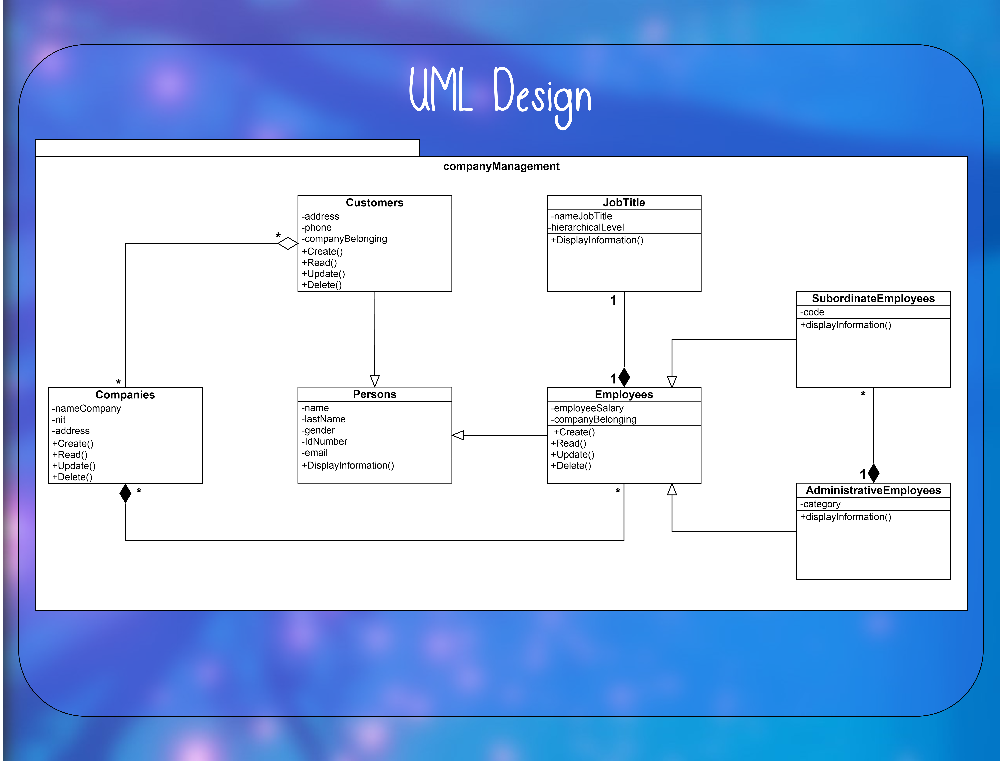

# txt file handling

The UML class diagram must be designed and implemented in a Java software to meet the needs outlined in the following statement:

* The software needs to manage information about the companies, their employees and their customers. Where the employees and customers have data such as first name, last name, ID and email.

* In addition, each employee is assigned a unique salary, and employees who are administrative have a category, as well as a set of subordinate employees.
Customers also need to know their mailing address and telephone number.

* An employee will always be assigned a position, which has a name and a hierarchical level within the company.

* The company has a corporate name (name), a tax identification number and an address. And it may or may not have associated customers, but it will always need employees.

* The software needs to show the data of the employees and customers, in addition to providing the CRUD operations for each entity.

--------------------------------------------------------------------------------------------------------------------

- #### UML Design:

