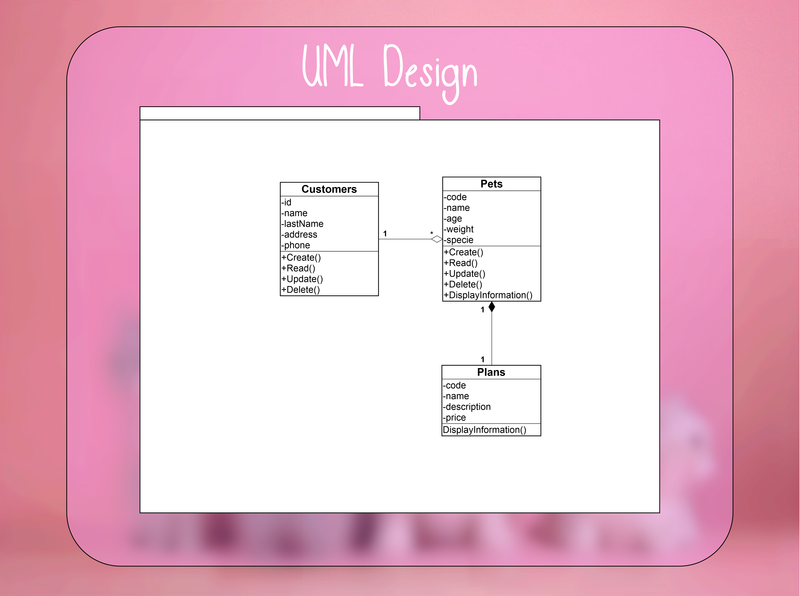
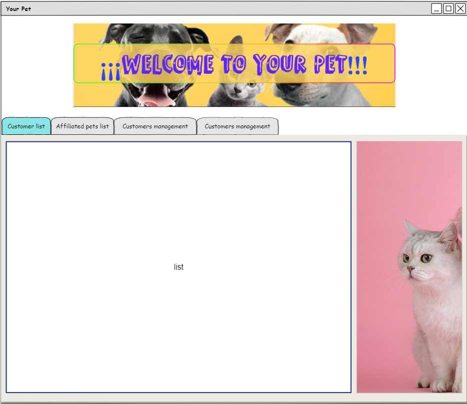
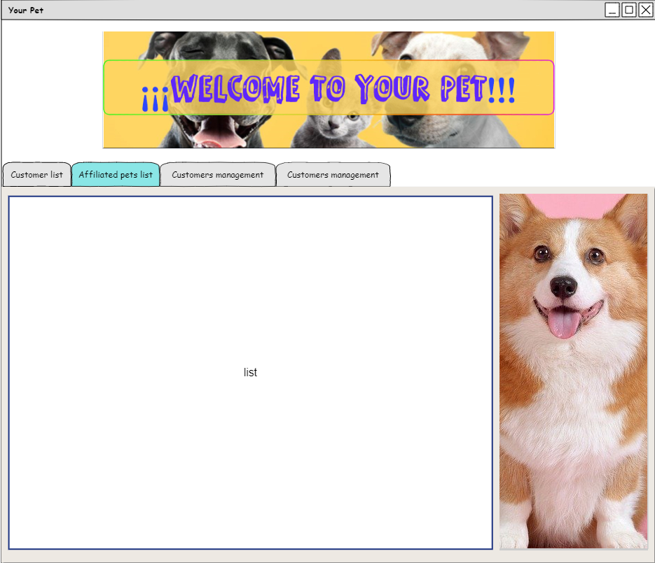
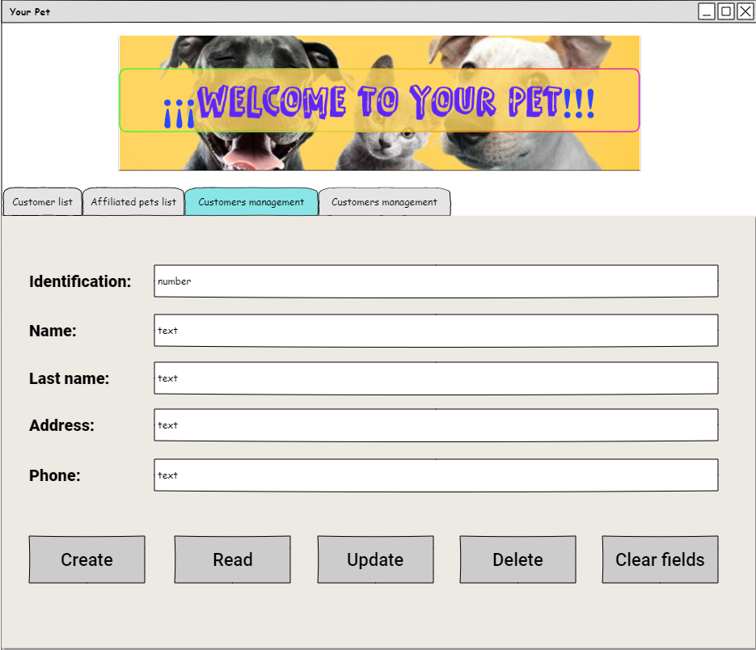
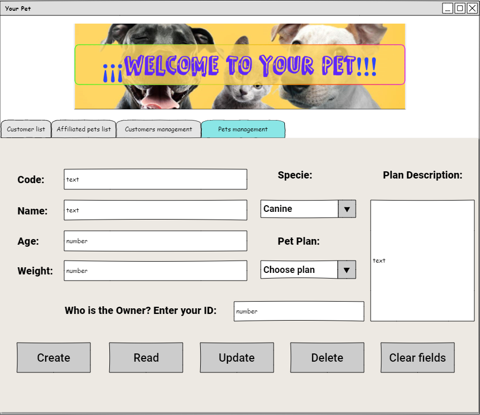

# Management of graphic interfaces

Software is to be developed for a pet care company. The software must meet a number of requirements as listed below:

* Manage customers (identification, first names, last names, address and phone number). Create, query, edit and delete (CRUD) options must be provided.

* The company offers three plans for the care and welfare of pets (welfare, elite and diamond), when a pet is affiliated to the company, it will always be affiliated to one of these three plans.

* The plans have a code, name, description and price.

* A customer may have one or more affiliated pets, even if he/she does not have affiliated pets.

* The pet's data are: code, name, age, weight, and species (canine or feline), in addition, each pet must be related to its owner.

* A project must be developed that includes the creation of the UML diagram and the implementation in Java with graphical interface management.

--------------------------------------------------------------------------------------------------------------------

- #### UML Design:

--------------------------------------------------------------------------------------------------------------------

- ### Mockup Design:

* Customer list:

* affiliated pets list:

* Customers management:

* Pets management:

--------------------------------------------------------------------------------------------------------------------
