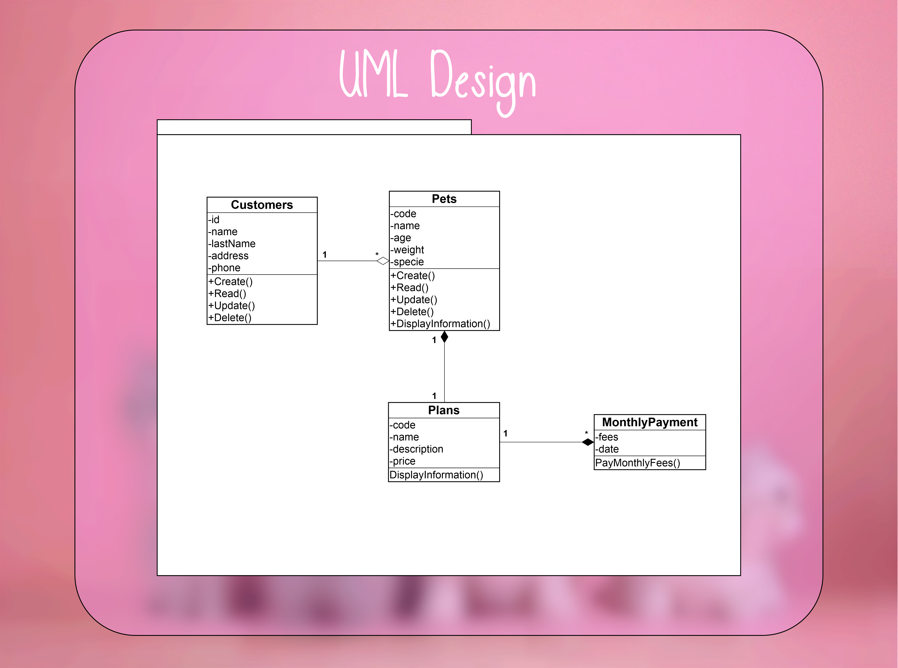
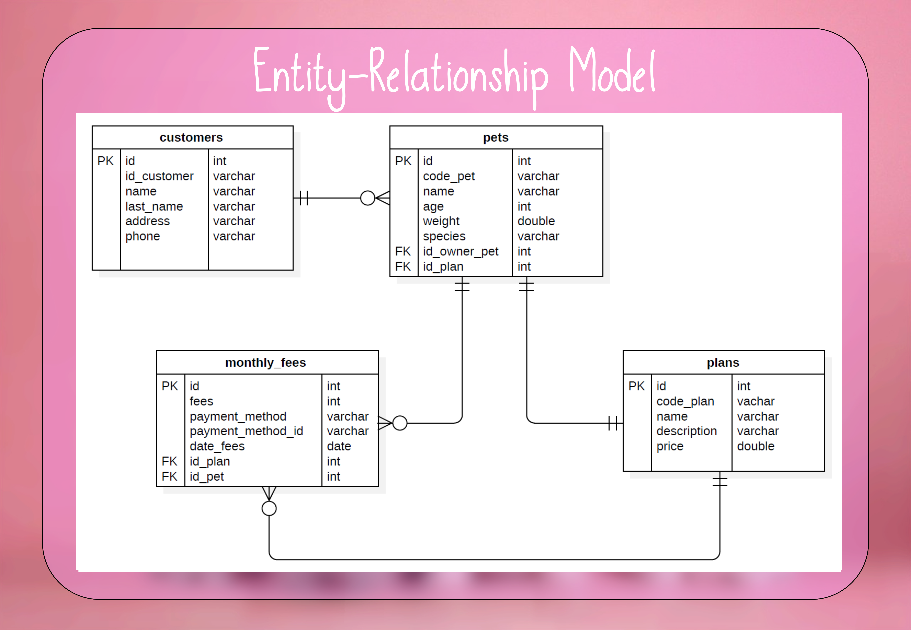
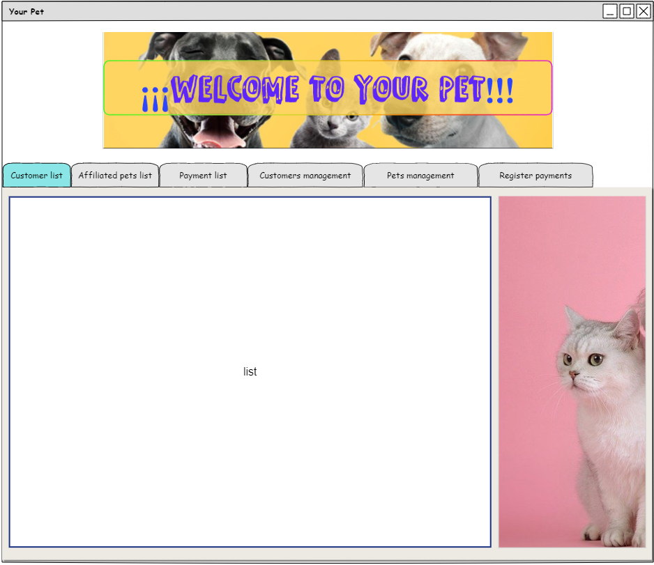
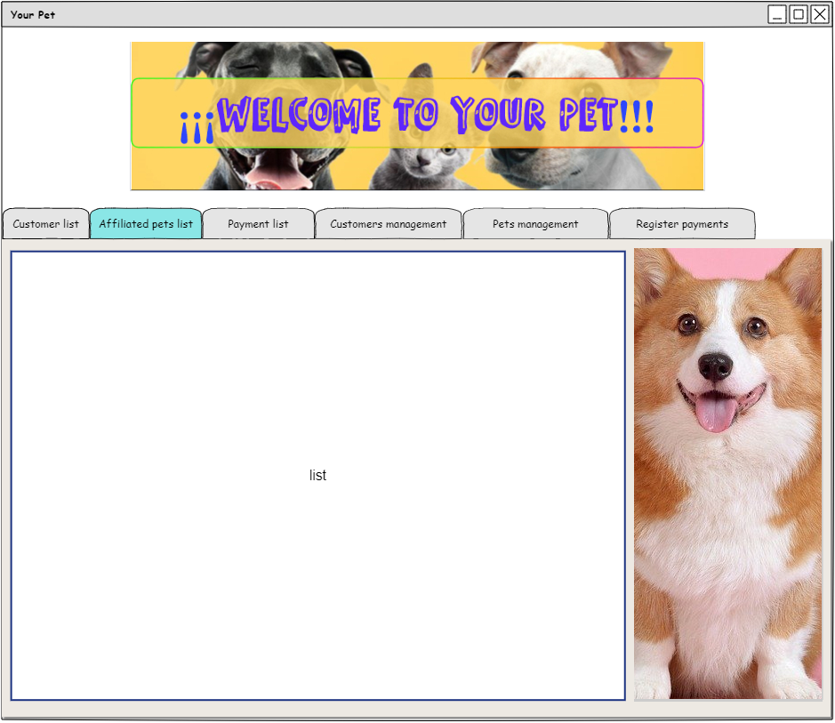
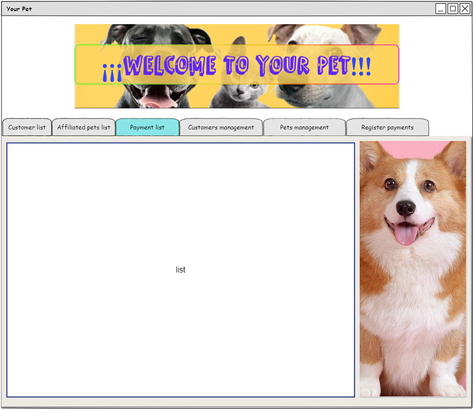
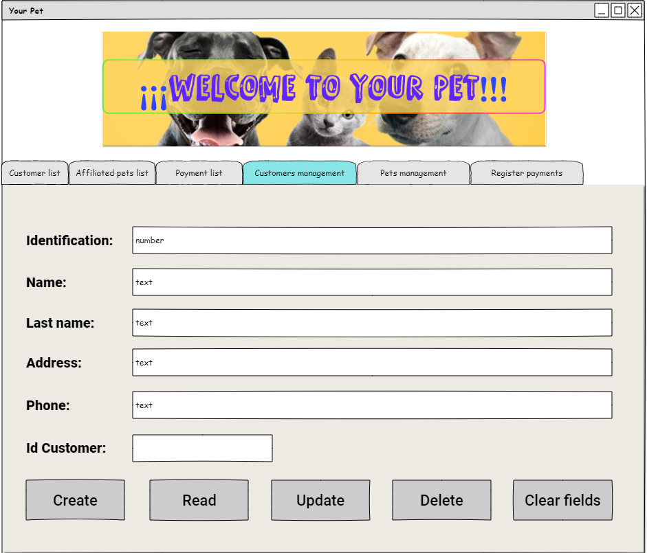
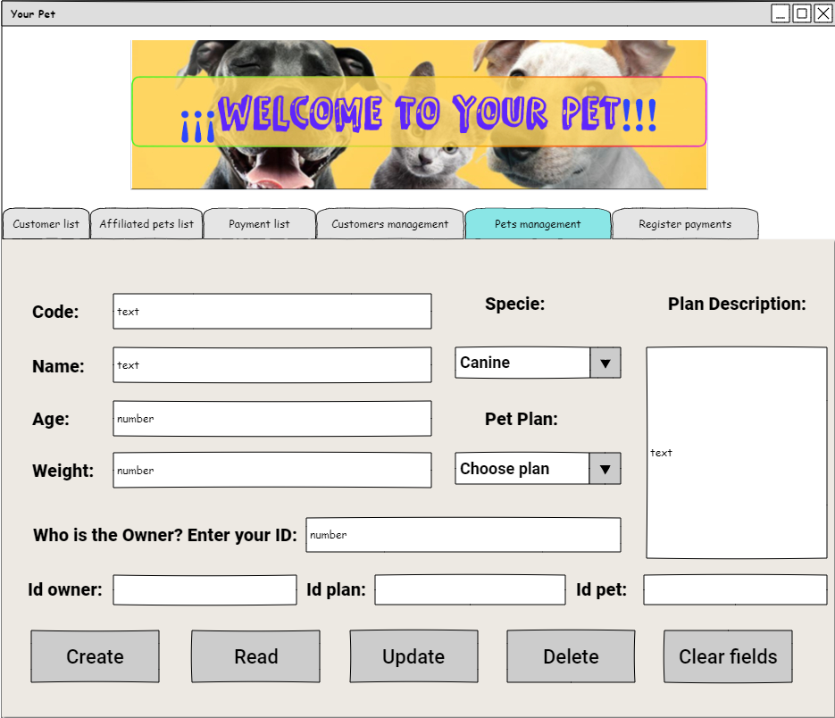
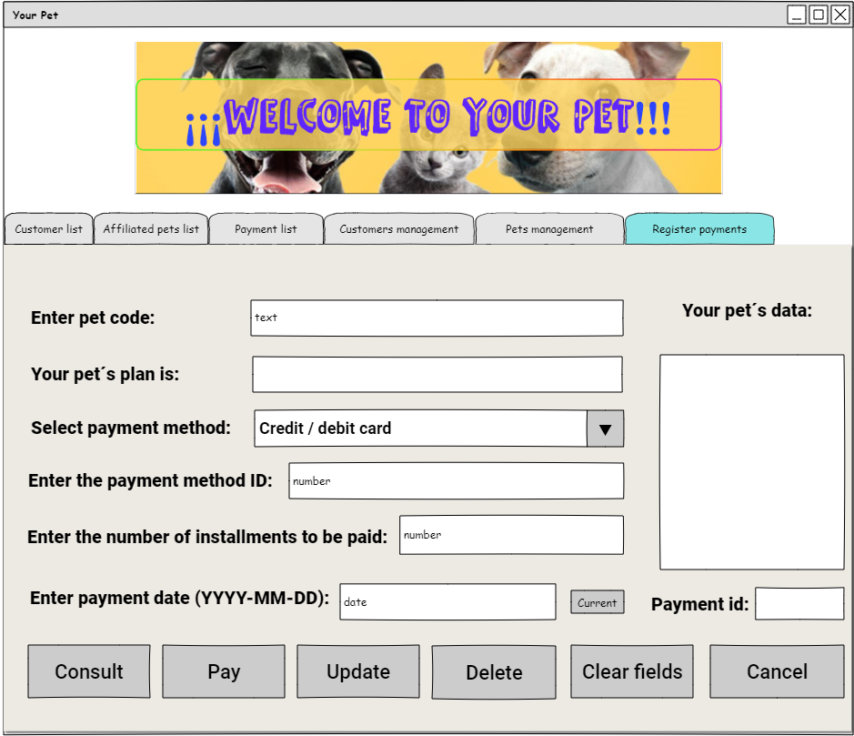

# Data management with databases and unit tests

Software is to be developed for a pet care company. The software must meet a series of requirements listed below:

* Manage customers (identification, first names, last names, address and telephone). Create, query, edit and delete (CRUD) options must be provided.

* The company offers three plans for the care and welfare of pets (wellness, elite and diamond), when a pet is affiliated to the company, it will always be affiliated to one of these three plans.

* The plans have a code, name, description and price.

* A client can have one or more affiliated pets, even if he/she does not have any affiliated pet.

* The pet data are: code, name, age, weight and species (canine or feline), in addition, each pet must be related to its owner.

* You must be given the option to enter the pet's monthly payment and you will also be able to see the information of the monthly payments per pet. When a monthly payment is made, the number of installments, the plan the pet is affiliated to and the payment date must be included.

* A project must be developed that includes the creation of the UML diagram and the implementation in Java with graphical interface management. In addition, all data must be stored in a database (MySQL), so the Entity Relationship model is also requested.

- Unit tests with the JUnit testing framework and the Mockito framework are requested.

--------------------------------------------------------------------------------------------------------------------

- #### UML Design:

--------------------------------------------------------------------------------------------------------------------

- ### Entity-Relationship Model:

--------------------------------------------------------------------------------------------------------------------

- ### Mockup Design:

* Customer list:

* affiliated pets list:

* payment list:

* Customers management:

* Pets management:

* Register payments:

--------------------------------------------------------------------------------------------------------------------